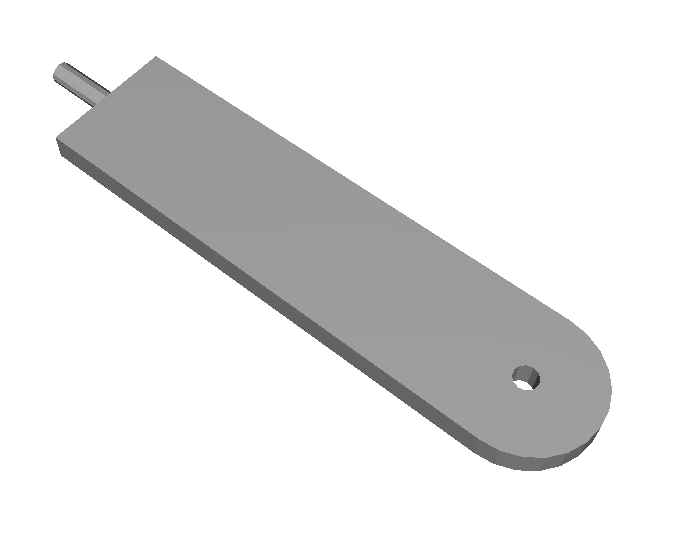
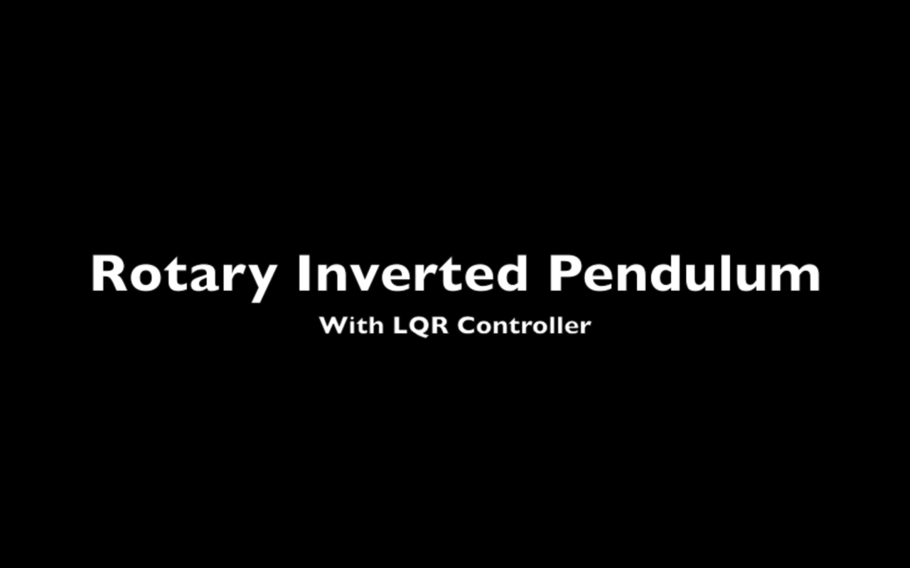

# Balancing_ROBOT

## Balancing Rotary Inverted Pendulum

### Construction of Robot

The robot is made of three parts - base, arm, pendulum.
Base Link | Arm | Pendulum
------------ | ------------- | -------------
 |  | 

They were modelled in solidworks, converted to urdf using plugin. The urdf is used by ROS to control robot and by  gazebo to simulate the robot.

### Controllers used in ROS

- Joint State Publisher - To get the current state of robot joints from gazebo. Here joint1 and joint2. It is available in ros.
- Joint Effort Controller - To control the torque applied to the particular joint. Here the torque is used to control joint1. Joint2 is a passive joint. It is available in ros.
- Balancing algorithm - To balance the pendulum in an upright position we have written a python program which commands the Joint Effort Controller how to change by reading joint values from Joint State Publisher.

### Balancing Algorithm

Here we use the Linear Quadratic Regulator(LQR) to achieve stability around the unstable equilibrium point(i.e., upright position). Since this algorithm is valid for a small range of values of angle for pendulum, we implement a pid controller for values outside this range(or for higher values of deviations in pendulum’s upright position). PID controller alone would not be able to stabilize the system, as it is very difficult to tune the pid values. PID results in a drift, which after some time accumulates and makes the system unstable. 

### Video

This video demostrates the working of the robot when a small disturbance is given to the arm.

### Note
>Put these files inside src of catkin workspace
